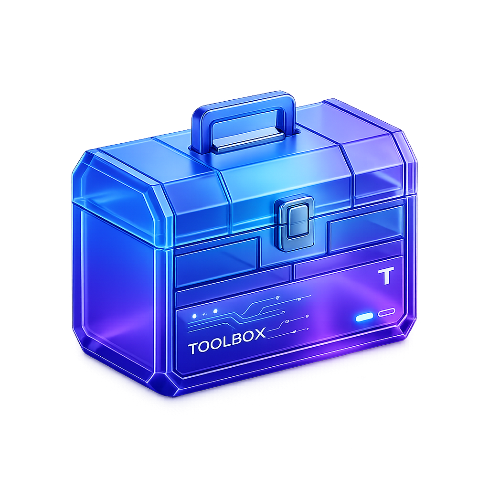

# 🧰 ToolBox - The Ultimate Developer Discovery Platform

ToolBox is a production-grade, curated directory system designed to solve the "too many tabs" problem for developers. It centralizes discovery and access to the best tools on the web across 18+ professional categories.



## 🚀 Features

-   **Curated Directory**: 75+ professional tools handpicked across 18 categories.
-   **Advanced Search**: Smart keyword-based search that matches related terms (e.g., searching "javascript" surfaces React, Node, and MDN).
-   **Premium UI/UX**: Dark-themed, glassmorphic design built with Tailwind CSS and Framer Motion for smooth transitions.
-   **Sidebar Filtering**: Elegant right-side sidebar for easy category navigation.
-   **Responsive Design**: Fully optimized for mobile, tablet, and desktop viewing.
-   **High Performance**: Built with React 18 and Vite for near-instant load times and interactions.

## 🛠️ Tech Stack

-   **Frontend**: React 18
-   **Build Tool**: Vite
-   **Styling**: Tailwind CSS
-   **Icons**: Lucide React
-   **Animations**: Framer Motion
-   **Routing**: React Router 6
-   **Deployment**: Vercel

## 📂 Project Structure

```text
src/
├── components/     # Reusable UI components
├── context/        # Global state management (ToolContext)
├── data/           # Seed data (75+ tools)
├── pages/          # Main application views
└── main.jsx        # App entry point
```

## 🏁 Getting Started

### Prerequisites
- Node.js (v16 or higher)
- npm or pnpm

### Installation

1.  **Clone the repository**:
    ```bash
    git clone https://github.com/rashidnarikkodan/Tool-Box.git
    cd Tool-Box
    ```

2.  **Install dependencies**:
    ```bash
    npm install
    ```

3.  **Run the development server**:
    ```bash
    npm run dev
    ```

4.  **Build for production**:
    ```bash
    npm run build
    ```

## 👨‍💻 Developer

Built with ❤️ by **Rashid Narikkodan**.

-   **GitHub**: [@rashidnarikkodan](https://github.com/rashidnarikkodan)
-   **LinkedIn**: [Rashid Narikkodan](#)
-   **Email**: [contact@rashidnarikkodan.com](mailto:contact@rashidnarikkodan.com)

## 📄 License

This project is open-source and available under the [MIT License](LICENSE).
